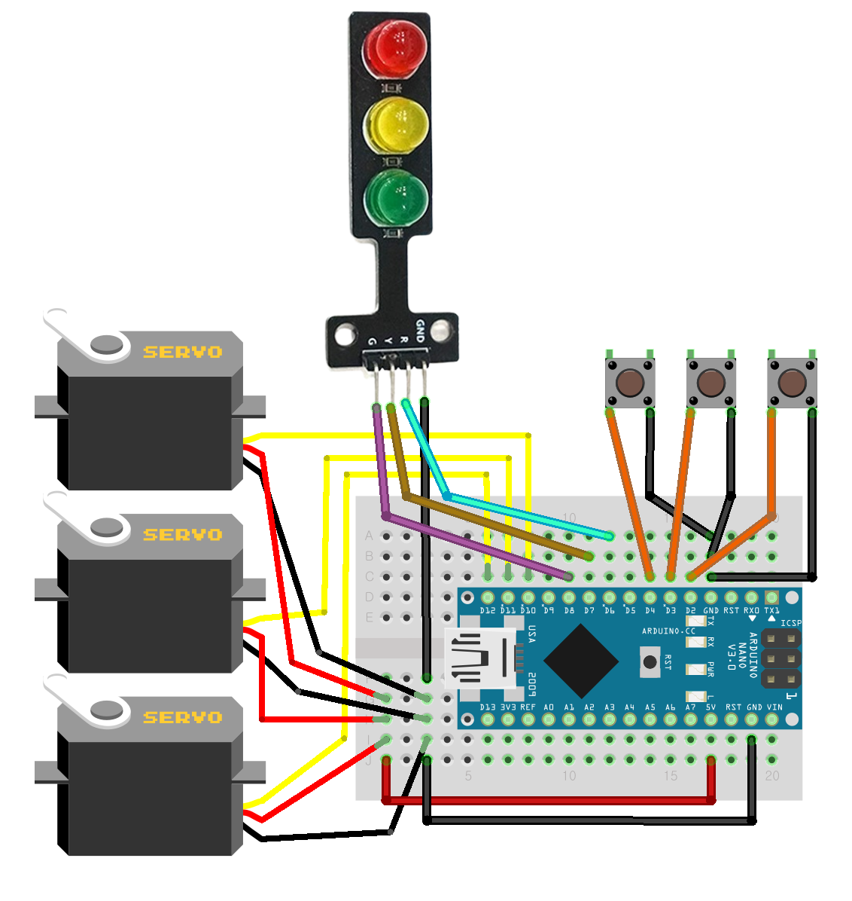
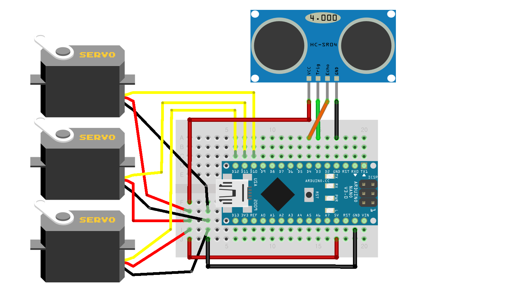

# Gongzipsa 가위바위보 키트 제작
초음파 센서 사용 버전과 미사용 버전 두가지가 있습니다.

## 버튼 사용 버전
가위, 바위, 보자기에 각각 해당하는 버튼이 있습니다.
3가지 버튼 중 하나를 누를 시 아두이노가 랜덤하게 한가지를 내게 되며 승패를 신호등 LED로 알려줍니다.

### 사용 부품
- 아두이노 나노
- 서보모터/SG90 3개
- 버튼 3개
- 3색 신호등 LED 모듈

### 라이브러리
- Servo.h
	- 기본 라이브러리로 설치 필요 X

### 연결
|아두이노 나노|서보모터 1|서보모터 2|서보모터 3|신호등LED모듈|버튼1|버튼2|버튼3|
|--|--|--|--|--|--|--|--|
|5V|+|+|+|||||
|GND|-|-|-|GND|연결|연결|연결|
|D2|||||연결|||
|D3||||||연결||
|D4|||||||연결|
|D6||||R||||
|D7||||Y||||
|D8||||G||||
|D10|S|||||||
|D11||S||||||
|D12|||S|||||

### 제품사진
(추가 예정)

## 초음파 센서 사용 버전
초음파 센서에 일정거리 이상 접근 시 가위, 바위, 보자기 중 하나를 랜덤으로 들어올리는 키트입니다.

### 사용 부품
- 아두이노 나노
- 서보모터/SG90 3개
- 초음파 센서/HC-SR04 1개

### 라이브러리
- Servo.h
	- 기본 라이브러리로 설치 필요 X

### 연결
|아두이노 나노|서보모터 1|서보모터 2|서보모터 3|초음파|
|--|--|--|--|--|
|5V|+|+|+|VCC|
|GND|-|-|-|GND|
|D3||||TRIG|
|D4||||ECHO|
|D10|S||||
|D11||S|||
|D12|||S||

## 일자별 진행상황
|날짜|진행사항|특이사항|
|--|--|--|
|2022/12/13|회로 구성 및 코드 1차 완성|수정사항 발생시 변경 가능성 有|
|2022/12/15|초음파 제외 버전 작성|수정사항 발생시 변경 가능성 有|
