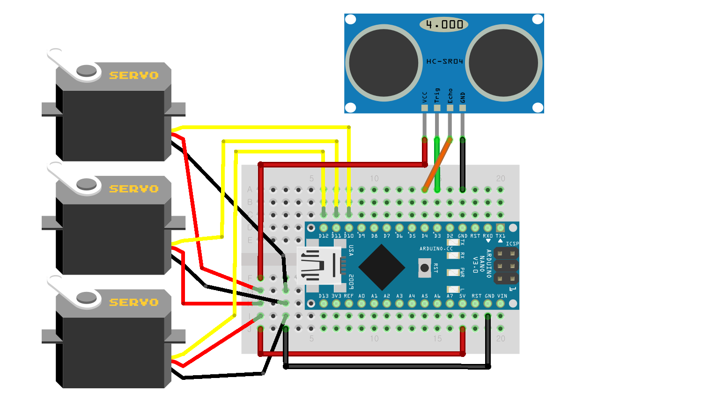

# Gongzipsa 가위바위보 키트 제작
초음파 센서에 일정거리 이상 접근 시 가위, 바위, 보자기 중 하나를 랜덤으로 들어올리는 키트입니다.

## 사용 부품
- 아두이노 나노
- 서보모터/SG90 3개
- 초음파 센서/HC-SR04 1개

## 라이브러리
- Servo.h
	- 기본 라이브러리로 설치 필요 X

## 연결
|아두이노 나노|서보모터 1|서보모터 2|서보모터 3|초음파|
|--|--|--|--|--|
|5V|+|+|+|VCC|
|GND|-|-|-|GND|
|D3||||TRIG|
|D4||||ECHO|
|D10|S||||
|D11||S|||
|D12|||S||

## 제품사진
(추가 예정)

## 일자별 진행상황
|날짜|진행사항|특이사항|
|--|--|--|
|2022/12/13|회로 구성 및 코드 1차 완성|수정사항 발생시 변경 가능성 有|